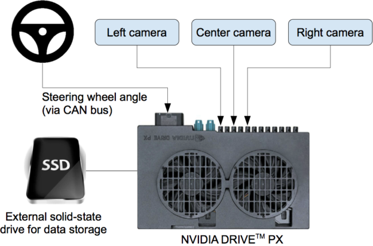

[](http://www.udacity.com/drive)

Behavioral Cloning Project
---
| | |
|------------------------------|--------------------------------|
|[`Lake Track`](https://www.youtube.com/watch?v=vTh4Q69m_q0)|[`Jungle Track`](https://www.youtube.com/watch?v=DAxUN5j4wKs)|


### Introduction
The goal of the project is to build a ML model to simulate a car to run in a autonomus mode that is provided by Udacity. The simulator can be found [here](https://github.com/udacity/self-driving-car-sim). The deep neural network will be used to build this model primalary Convolutional Neuaral Network(CNN) will be implemented by using [NVIDIA End-to-End Deep Learning for Self-Driving Cars architecture](https://developer.nvidia.com/blog/deep-learning-self-driving-cars/). There are two provided lane tracks to generate training data for this project and this project requirement is to build a model for first track. To continue this project successfuly following steps were proccessed.

* Data Preprocessing & Image Data Aumentation
* Traning Data Preparation
* Building the Model Architecture
* Training the Model
* Testing with Simulator

### Data Preprocessing
To undestand about these simulator generated data I used a 'Jupyter Notebook](image_utils.ipynb) and did some preliminary data precessing steps.  
**Note: This Jupyter file is not covering all the steps I was followed and it was used to start image preprocessing.**

Following is the simulator generated driving logs CSV's Pandas dataframe head.


#### The Data
This simulator is generating a CSV file with **7** columns and there are **3** of columns contain images related details namely **center, left, and right**. These are the our input lables that we want to use to build a this **Regression** model. The output of the model is **streering** the streering angle for three images. In real case these three images are taken from three different cameras at the same time.  Following is the high level view of the data collection system that is used by NVIDIA.



Image source: https://developer.nvidia.com/blog/deep-learning-self-driving-cars/

And following are the simulator generated (track01) images samples respctively **center, left, and right**.

Center | Left | Right|
-------|------|------|
|  ||  

#### Basic Image Processing
I used few basic image processing techniques to clean and have nice image data to input for CNN model. Following are the **Python** functions were used to do image processing.

###### Cropping
This is used to remove Sky and other unnecessray things from training image data.

```python
# Crop images to extract required road sections and to remove sky from the road
def crop_image(in_img):
    """
    This is used to cropping images 
    """
    return in_img[60:-25,:,:]
    
```    

###### Re-sizing

```python
# resize the images
def resize_image(in_img):
    """
    This is an utility function to resize images
    """
    return cv2.resize(in_img, (i_width, i_height), cv2.INTER_AREA)

```

###### Colour channel changing
Here NVIDIA was used to RGB to YUV color channel covertions [readings](https://en.wikipedia.org/wiki/YUV).

```python


# convert RGB to YUV image
def convert_rgb2yuv(in_img):
    """
    This is an utility function to convert RGB images to YUV.
    This technique was intr by NVIDIA for their image pracessing pipeline
    """
    return cv2.cvtColor(in_img, cv2.COLOR_RGB2YUV)
```

Following are the image processing pipeline results.

Original | Cropped | Resized | YUV|
---------|---------|---------|----|
| |  | |

#### Additional Data Generation
Udacity provided data set were used to initial training and while tuning the the model additional data were generated by using Udacity simulator. In addition to  data augmentation was used to provde more features for the CNN model. Following are the used data augmentation techniques.

###### Random flip

```python
# Flip images
def random_flip(img, streering_angle):
    """
    Flipping images randomly
    """
    if np.random.rand() < 0.5:
        img = cv2.flip(img, 1)
        streering_angle = - streering_angle

    return img, streering_angle
```

###### Random translate

```python
# Translate images
def random_translate(img, streering_angle, range_x, range_y):
    """
    Randomly shift the image virtially and horizontally (translation).
    """

    trans_x = range_x * (np.random.rand() - 0.5)
    trans_y = range_y * (np.random.rand() - 0.5)
    streering_angle += trans_x * 0.002
    trans_m = np.float32([[1, 0, trans_x], [0, 1, trans_y]])
    h, w = img.shape[:2]
    img = cv2.warpAffine(img, trans_m, (w, h))
    return img, streering_angle

```

###### Random shadow

```python
# Add random shadow
def random_shadow(img):
    """
    Generates and adds random shadow
    """
    # (x1, y1) and (x2, y2) forms a line
    # xm, ym gives all the locations of the image
    x1, y1 = i_width * np.random.rand(), 0
    x2, y2 = i_width * np.random.rand(), i_height
    xm, ym = np.mgrid[0:i_height, 0:i_width]

    # mathematically speaking, we want to set 1 below the line and zero otherwise
    # Our coordinate is up side down.  So, the above the line:
    # (ym-y1)/(xm-x1) > (y2-y1)/(x2-x1)
    # as x2 == x1 causes zero-division problem, we'll write it in the below form:
    # (ym-y1)*(x2-x1) - (y2-y1)*(xm-x1) > 0
    mask = np.zeros_like(img[:, :, 1])
    mask[(ym - y1) * (x2 - x1) - (y2 - y1) * (xm - x1) > 0] = 1

    # choose which side should have shadow and adjust saturation
    cond = mask == np.random.randint(2)
    s_ratio = np.random.uniform(low=0.2, high=0.5)

    # adjust Saturation in HLS(Hue, Light, Saturation)
    hls = cv2.cvtColor(img, cv2.COLOR_RGB2HLS)
    hls[:, :, 1][cond] = hls[:, :, 1][cond] * s_ratio

    return cv2.cvtColor(hls, cv2.COLOR_HLS2RGB)
    
```

###### Random brightness

```python
# Adgust brightness randomly
def random_brightness(img):
    """
    Randomly adjust brightness of the image.
    """

    # HSV (Hue, Saturation, Value) is also called HSB ('B' for Brightness).
    hsv = cv2.cvtColor(img, cv2.COLOR_RGB2HSV)
    ratio = 1.0 + 0.4 * (np.random.rand() - 0.5)
    hsv[:, :, 2] = hsv[:, :, 2] * ratio

    return cv2.cvtColor(hsv, cv2.COLOR_HSV2RGB)
    
```
Flip| Translate | Shadow | Brightness|
----|-----------|--------|-----------|
| |  | | 

##### Image Augmentation

Following function was used to do image data augmentation.

```python
# Image data augmentation
def augment(image_path, in_streering_angle, range_x=100, range_y=10):
    """
    Augmenting images
    """
    img, steering_angle = select_random_image(image_path, in_streering_angle)

    img, steering_angle = random_flip(img, steering_angle)
    img, steering_angle = random_translate(img, steering_angle, range_x, range_y)
    img = crop_image(img)
    img = resize_image(img)
    img = random_shadow(img)
    img = random_brightness(img)
    img = convert_rgb2yuv(img)

    return img, steering_angle
```

Following is the sample augmented image.

 


### Traning Data Preparation
I have generated tranning data before start training process and saved as Numpy compressed files using using [`np.savez_compresse`](https://numpy.org/doc/stable/reference/generated/numpy.savez_compressed.html). Following function was used to generate tranning data set.

```python
def batch_generator(image_paths, steering_angles, batch_size, total_samples, is_training):
    """
    Generate training image give image paths and associated steering angles
    """
    X = np.empty([total_samples * batch_size, i_height, i_width, i_channels], dtype=np.float32)
    y = np.empty(total_samples * batch_size, dtype=np.float32)

    row = 0
    for idx in tqdm(range(total_samples)):
        i = 0
        for index in np.random.permutation(image_paths.shape[0]):

            image_path = image_paths[index]
            steering_angle = steering_angles[index]
            # argumentation
            if is_training and np.random.rand() < 0.6:
                image, steering_angle = augment(image_path, steering_angle)

            else:
                image = load_image(image_path[0])
                image = preprocess(image)
                # add the image and steering angle to the batch
            X[row] = image
            y[row] = steering_angle

            row += 1
            i += 1
            if i == batch_size:
                break

    np.savez_compressed("./numpy/train-data", X=X, y=y)

    print("X shape: ", X.shape)
    print("Y shape: ", y.shape)
    
```

### Build Model Architecture
This CNN architecture was implemented based on [`NVIDIA paper`](https://images.nvidia.com/content/tegra/automotive/images/2016/solutions/pdf/end-to-end-dl-using-px.pdf). Following is the original architecture diagram.

|||
|----------------------------------|-----------------------------------|
| Original Paper Image             | Tensorflow Keras Model Summary    |

Following is Tensorflow Python implementation for above CNN architecture.

```python
def build_model():
    """
    This the model architecture to build CNN model.
    """
    model = keras.Sequential(
        [
            layers.Lambda(lambda x: x / 127.5 - 1.0, input_shape=img_shape),
            layers.Conv2D(filters=24, kernel_size=(5, 5), strides=(2, 2), activation='elu'),
            layers.Conv2D(filters=36, kernel_size=(5, 5), strides=(2, 2), activation='elu'),
            layers.Conv2D(filters=48, kernel_size=(5, 5), strides=(2, 2), activation='elu'),
            layers.Conv2D(filters=64, kernel_size=(3, 3), activation='elu'),
            layers.Conv2D(filters=64, kernel_size=(3, 3), activation='elu'),
            layers.Dropout(0.5),
            layers.Flatten(),
            layers.Dense(100, activation='elu'),
            layers.Dense(50, activation='elu'),
            layers.Dense(10, activation='elu'),
            layers.Dense(1)
        ])

    return model
```
